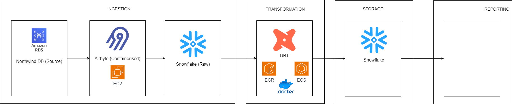

# Project Plan

## Objective 

The objective of our project is to provide analytical datasets from our Northwind database.

## Consumers 

The users of out dataset are ... . From dashboards using Table, Power BI.

## Questions 

...

## Source dataset 

| Source name                     | Source Type         | 
| ------------------------------- | ------------------- |
| Northwind database for Postgres | PostgreSQL database |

## Solution architecture 

Architecture:

- Source Database (PostgreSQL on AWS RDS): Holds raw data.
- Airbyte on EC2: Extracts data from RDS.
- DBT: Transforms data.
- Snowflake Data Warehouse: Stores transformed data.
- ...: Uses data for visualization.

Patterns:

- Data Extraction: Batch extraction with Airbyte.
- Data Loading: Batch loading to Snowflake.
- Data Transformation: ELT pattern.

Here is a solution architecture diagram:

