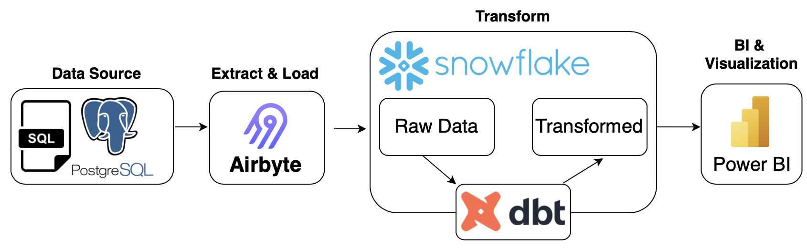
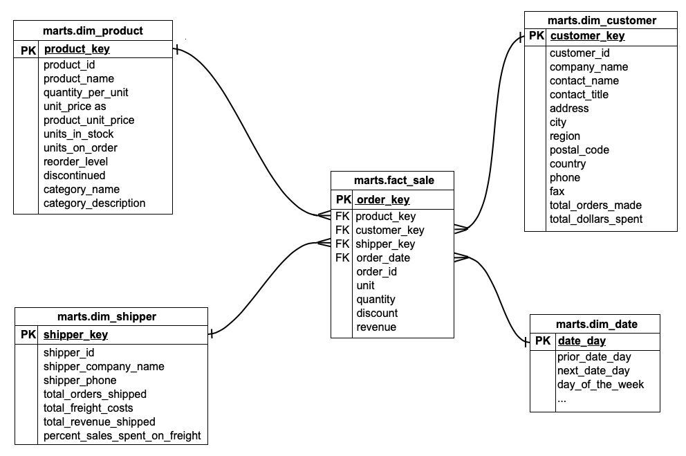

# Northwind ELT


## Introduction 

This is a demo project to create an ELT pipeline using airbyte, dbt, snowflake and AWS. 



- [airbyte](https://docs.airbyte.com/)
- [dbt](https://docs.getdbt.com/docs/introduction)
- [snowflake](https://docs.snowflake.com/en/)

Accompanying presentation [here](docs/northwind.pdf)

## Getting started 

1. Create a new snowflake account [here](https://signup.snowflake.com/)

2. Export the following environment variables 

    ```
    export SNOWFLAKE_USERNAME=your_snowflake_username
    export SNOWFLAKE_PASSWORD=your_snowflake_password
    export SNOWFLAKE_ACCOUNT_ID=your_snowflake_account_id
    ```

3. Install the python dependencies

    ```
    pip install -r requirements.txt
    ```

4. Create the mock source database by: 
    - Install [postgresql](https://www.postgresql.org/)
    - Create a new database in your localhost called `northwind` 
    - Run SQL file in your new database [northwind.sql](integration/source/northwind.sql)

## Using airbyte 

1. Create a source for the postgresql database `northwind`
    - host: `host.docker.northwind`
2. Create a destination for the Snowflake database 
3. Create a connection between `northwind` and `snowflake` 
    - Namespace Custom Format: `<your_destination_schema>`
4. Run the sync job 

## Using snowflake 

1. Log in to your snowflake account 
2. Go to `worksheets` > `+ worksheet`
3. Query one of the synced tables from airbyte in the raw schema e.g. `select * from warehouse_northwind.raw.customer` 
4. Create a new schema `staging` and `marts` in the warehouse_northwind database

## Using dbt 

1. `cd` to `transform/northwind` 
2. Execute the command `dbt docs generate` and `dbt docs serve` to create the dbt docs and view the lineage graph 
3. Execute the command `dbt build` to run and test dbt models



## Using AWS to deploy solution

1. Log in to ECR using the AWS CLI
    - `aws ecr get-login-password --region <your-region> | docker login --username AWS --password-stdin <your-account-id>.dkr.ecr.<your-region>.amazonaws.com`

2. cd into `transform` folder and build the docker image with the following command:
    - `docker build -t <your-image-name> .`

3. Tag your docker image
    - `docker tag <your-image-name>:<tag> <your-account-id>.dkr.ecr.<your-region>.amazonaws.com/<your-repository-name>:<tag>`

4. Push Docker Image to ECR
    - `docker push <your-account-id>.dkr.ecr.<your-region>.amazonaws.com/<your-repository-name>:<tag>`

5. Login to your AWS console

6. Set Up ECS Cluster

7. Create ECS Task Definition and add Snowflake environment variables

5. Create a new task using the cluster and task definition from steps 5 & 6 and schedule/run the task accordingly