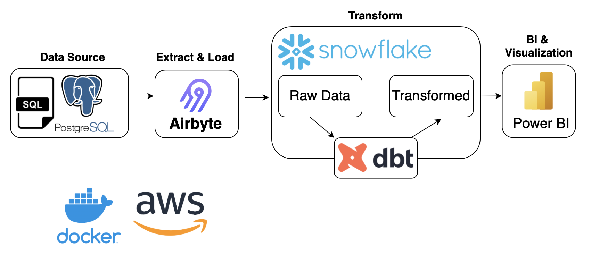

# Northwind ELT


## Project Context 

To help Northwind Store track orders, shipments, inventory and customer information with an ELT pipeline

### Goals
1. Business solutions relating to revenue, inventory level, shipment costs, order volume
2. This data pipeline would be valuable to Northwind to increase efficiency and lower costs

This ELT pipeline uses airbyte, dbt, snowflake and AWS. The architecture diagram below outlines how the ELT pipeline works:
1. A source SQL file is loaded into PostgreSQL
2. Airbyte will extract the data from PostgreSQL and load it into Snowflake
3. DBT will take the raw data from Snowflake and transform it 
4. Using Power BI, we will then take that transformed data and create a semantic layer & visualizations



- [airbyte](https://docs.airbyte.com/)
- [dbt](https://docs.getdbt.com/docs/introduction)
- [snowflake](https://docs.snowflake.com/en/)

Accompanying project presentation [here](docs/northwind.pdf)

## Getting started 

1. Create a new snowflake account [here](https://signup.snowflake.com/)

2. Export the following environment variables 

    ```
    export SNOWFLAKE_USERNAME=your_snowflake_username
    export SNOWFLAKE_PASSWORD=your_snowflake_password
    export SNOWFLAKE_ACCOUNT_ID=your_snowflake_account_id
    ```

3. Install the python dependencies

    ```
    pip install -r requirements.txt
    ```

4. Create the mock source database by: 
    - Install [postgresql](https://www.postgresql.org/)
    - Create a new database in your localhost called `northwind` 
    - Run SQL file in your new database [northwind.sql](integration/source/northwind.sql)

## Using airbyte 

1. Create a source for the postgresql database `northwind`
    - host: `host.docker.northwind`
2. Create a destination for the Snowflake database 
3. Create a connection between `northwind` and `snowflake` 
    - Namespace Custom Format: `<your_destination_schema>`
4. Run the sync job 

## Using snowflake 

1. Log in to your snowflake account 
2. Go to `worksheets` > `+ worksheet`
3. Query one of the synced tables from airbyte in the raw schema e.g. `select * from warehouse_northwind.raw.customer` 
4. Create a new schema `staging` and `marts` in the warehouse_northwind database

## Using dbt 

1. `cd` to `transform/northwind` 
2. Execute the command `dbt docs generate` and `dbt docs serve` to create the dbt docs and view the lineage graph 
3. Execute the command `dbt build` to run and test dbt models


## Using AWS to deploy solution

1. cd into `transform` folder and build the docker image locally with the following command:
    - `docker build -t <your-image-name> .`

2. Run the docker image locally to test that it is working
    - `docker run -e SNOWFLAKE_USERNAME=<snowflake-username> -e SNOWFLAKE_PASSWORD=<snowflake-password> -e SNOWFLAKE_ACCOUNT_ID=<snowflake-account-id> <your-image-name>`

3. Create a new repository in ECR

4. Click on your new repository in ECR and click on `View push commands` and follow the instructions listed to do the following:
    - Login to your ECR in your terminal using AWS CLI:
        - `aws ecr get-login-password --region <your-region> | docker login --username AWS --password-stdin <your-account-id>.dkr.ecr.<your-region>.amazonaws.com`
    - Build your docker image
        - `docker build -t <your-repository-name> .`
    - Tag your docker image
        -`docker tag <your-repository-name>:<tag> <your-account-id>.dkr.ecr.<your-region>.amazonaws.com/<your-repository-name>:<tag>`
    - Push your docker image into your repository
        - `docker push <your-account-id>.dkr.ecr.<your-region>.amazonaws.com/<your-repository-name>:<tag>`

5. Set Up an ECS Cluster

6. Create ECS Task Definition and add Snowflake environment variables

7. Create a new task using the cluster and task definition from steps 5 & 6 and schedule/run the task accordingly